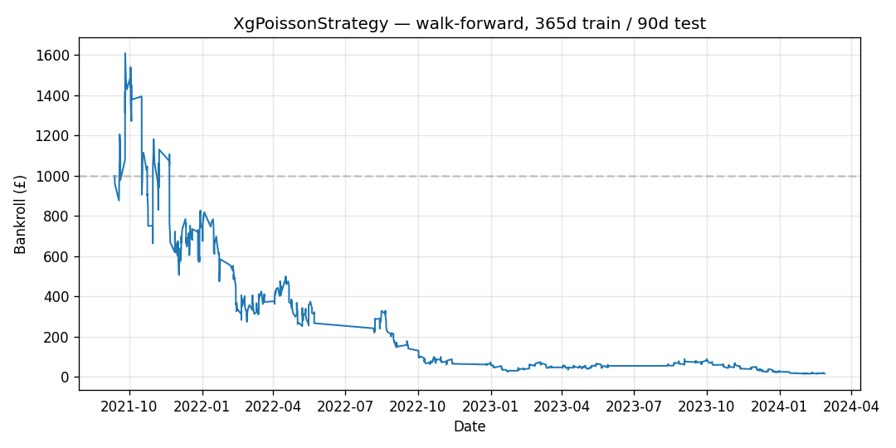

# betting-backtester

A Python library for testing sports-betting strategies against historical or synthetic 1X2 (home / draw / away) market data. It tells you what a strategy would have earned, with walk-forward evaluation, bootstrap confidence intervals, and Betfair-style per-market commission applied — the controls needed to distinguish a real edge from a lucky historical fit.

This is a research tool, not a trading bot. It simulates bets; it does not place them.

## What it does

You provide:

- A **data source** — either a CSV loader (currently football-data.co.uk) or a synthetic event generator.
- A **strategy** — a class implementing the `Strategy` protocol (`fit`, `on_odds`, `on_settled`).
- A **commission model** — Betfair-style per-market commission with a configurable rate.
- A **starting bankroll**.

The library simulates the strategy against the event stream event by event, respecting time ordering. It tracks bets placed, commitments held, settlements, rejections, and realised P&L. You get back a structured result with per-match equity, summary metrics, and a bootstrap confidence interval on yield.

## Quick start

Run a baseline strategy (back the shortest-priced selection on every match) against a synthetic stream of 500 matches:

```python
from datetime import datetime, timezone
from betting_backtester.synthetic import (
    SyntheticGenerator, SyntheticGeneratorConfig, TrueProbabilities,
)
from betting_backtester.strategies.favourite_backer import FavouriteBacker
from betting_backtester.commission import NetWinningsCommission
from betting_backtester.backtester import Backtester
from betting_backtester.backtest_result import BacktestResult
from betting_backtester.reporting import compute_yield_ci

config = SyntheticGeneratorConfig(
    n_matches=500,
    true_probs=TrueProbabilities(home=0.45, draw=0.27, away=0.28),
    seed=42,
    start=datetime(2024, 8, 1, 15, 0, tzinfo=timezone.utc),
)

backtester = Backtester(
    event_source=SyntheticGenerator(config),
    strategy=FavouriteBacker(stake=10.0),
    commission_model=NetWinningsCommission(rate=0.05),
    starting_bankroll=1_000.0,
    seed=0,
)

raw = backtester.run()
result = BacktestResult.from_raw(raw, starting_bankroll=1_000.0, t0=config.start)
ci = compute_yield_ci(result, n_resamples=10_000, seed=0)

print(f"Net P&L: {result.summary_metrics.net_pnl:+.2f}")
print(f"Bets:    {result.summary_metrics.n_bets}")
print(f"Yield:   {ci.mean:.4%}  (95% CI: [{ci.lower:.4%}, {ci.upper:.4%}])")
```

Swap `FavouriteBacker` for `XgPoissonStrategy` to run a real model. Swap `SyntheticGenerator` for `FootballDataLoader` to run on historical data. Wrap the whole thing in `WalkForwardEvaluator` for rolling train/test evaluation.

## Example: does an xG-based betting strategy actually work?

A common claim in football betting circles is that xG-based models produce profitable long-run yields because bookmakers under-price information that xG exposes. Here's what this library says about that claim, tested against four Premier League seasons (2020/21 – 2023/24, 1520 matches from [football-data.co.uk](https://www.football-data.co.uk/englandm.php)).

**Setup:**

- `XgPoissonStrategy` with edge threshold 2%, quarter-Kelly sizing, 5% max exposure per bet.
- `WalkForwardEvaluator` with 365-day training windows and 90-day test windows.
- 5% commission, £1000 starting bankroll.

**Result:**

```
Windows:  10
Bets:     2233
Net P&L:  -£982.10
Yield:    -5.32%  (95% CI: [-15.85%, +5.56%])
```



The strategy lost 98% of its bankroll over three years. But the bootstrap CI on yield is wide — [-15.85%, +5.56%] — and does not exclude zero. So what does the data actually say?

A £982 loss alongside a yield estimate consistent with zero points not to a cleanly negative edge but to **miscalibration under Kelly sizing**. The equity curve makes this visible: the strategy works for the first four months (bankroll climbs to £1600), then cascades to ruin as the model's probability estimates diverge from reality in later windows. Kelly amplifies miscalibration into bankroll collapse even when the average per-bet edge is near zero. A naive backtest reporting only final P&L would hide this; walk-forward evaluation combined with the CI makes the failure mode legible.

The honest conclusion isn't "xG betting doesn't work." It's "a Dixon-Coles-lite model with quarter-Kelly sizing on Premier League 1X2 markets is not calibrated well enough to survive Kelly's variance, and four seasons of data aren't enough to pin down the true edge to better than ±10%." Those are two different statements. The library forces the distinction.

Reproduce with `scripts/generate_readme_example.py` (requires the four Premier League CSVs at `data/2020-21/E0.csv` through `data/2023-24/E0.csv`).

## Modules

| Module | Purpose |
|---|---|
| `models` | Pydantic event and fixture types (`Match`, `OddsSnapshot`, `MatchResult`, `SelectionOdds`, `OddsAvailable`, `MatchSettled`). UTC-only, `back_price <= lay_price` invariant. |
| `synthetic` | `SyntheticGenerator` — fair-odds event streams from a configured outcome distribution. Deterministic under seed. Used as a correctness rig. |
| `football_data` | `FootballDataLoader` — reads football-data.co.uk CSVs. Pinnacle odds only. Exposes `.matches` for strategies that need team identity. |
| `commission` | `NetWinningsCommission` — per-market aggregation with winners-only pro-rata attribution, `math.fsum` throughout. |
| `backtester` | Core simulator, `Strategy` protocol, `PortfolioView`, bet-ID scheme, rejection log, bankroll invariants enforced to 1e-6. |
| `backtest_result` | `BacktestResult`, `SummaryMetrics`, `EquityPoint`. Per-match equity curve and summary statistics. |
| `reporting` | Bootstrap confidence interval on yield; per-match resampling to preserve intra-match correlation. |
| `walk_forward` | `WalkForwardEvaluator` — rolling time-based train/test windows with chained bankroll. |
| `dixon_coles` | Dixon-Coles-lite goal-rate model: attack/defence ratings plus home advantage, fit by weighted L2-regularised MLE. |
| `kelly` | Back and lay Kelly sizing utilities. |
| `arbitrage_generator` | `ArbitrageGenerator` with injectable arbs via the `ArbSchedule` protocol (fixed positions or Bernoulli rate). |
| `strategies/favourite_backer` | Baseline: back the shortest-price selection every match. |
| `strategies/xg_poisson` | Dixon-Coles plus fractional Kelly; back or lay when model probability diverges from market-implied by a configurable edge threshold. |
| `strategies/arbitrage_detector` | Back-side three-way arbitrage detector with equal-profit staking. |

## Design choices

A few decisions worth calling out because they're the difference between a toy backtester and a research-usable one.

**Walk-forward evaluation for any strategy with a `fit` method.** A one-shot fit-then-evaluate on the whole dataset leaks information from the test set into training. `WalkForwardEvaluator` runs independent train/test cycles over rolling windows with chained bankroll.

**Bootstrap CIs resample matches, not bets.** Bets within a match are correlated (especially for multi-bet strategies like arbitrage). Resampling at the match level preserves that structure; resampling at the bet level would understate variance.

**Commission aggregated per market.** `NetWinningsCommission` sums a market's gross P&L across all bets, applies the commission rate once, and attributes the charge pro-rata to winners. This matches Betfair's model and makes arbitrage strategies survive commission as a clean multiplicative scaling rather than a per-bet subtraction.

**Lookahead safety is structural, not conventional.** Strategies receive events through the `Strategy` protocol and never hold a forward iterator. A regime-reversal test in the suite verifies that a strategy trained on one set of team strengths bets according to those strengths — and loses — when test-window outcomes reverse. A lookahead leak would flip the sign.

**Determinism is a tested invariant.** Identical inputs produce byte-identical outputs at every level (strategy, generator, evaluator, pipeline). Verified explicitly, not assumed.

## Installation

```bash
git clone https://github.com/<your-username>/betting-backtester.git
cd betting-backtester
uv sync
```

Python 3.12. Dependencies: `pydantic`, `scipy`, `numpy`.

## Tests

```bash
uv run pytest              # full suite, ~800 tests
uv run mypy --strict src
uv run ruff check
```

## What this is not

No live-venue integration. No order routing. No slippage or latency modelling. No partial-fill handling. No market-impact simulation. A strategy that performs well in this library is a strategy with an edge on clean synthetic or historical data; closing the gap to a live deployment is a separate project.

The library is explicit about this because a backtester that silently promises live-viable results is a worse tool than one that's honestly scoped.

## License

MIT.